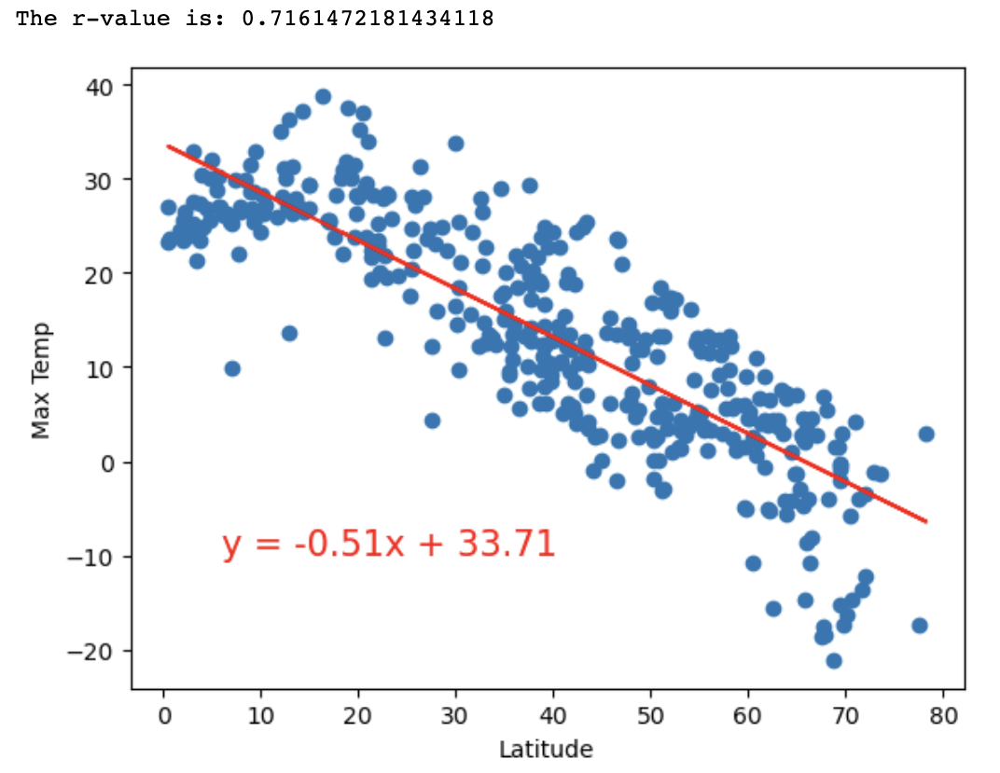
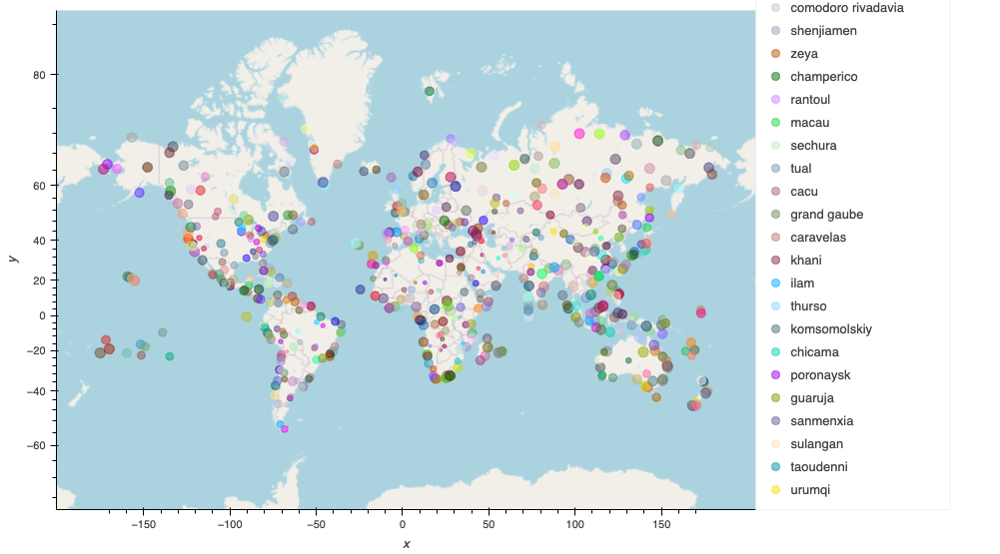
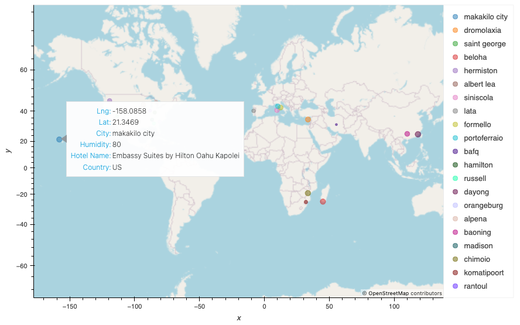

# Python_api_challenge
This exercise use Python, Pandas, Matplotlib, Citipy and APIs to generate data, create dataframes and csv files, which will then be used to create plots and maps to narrow down cities and hotels for vacation trips. 
## Background 
Data's true power is its ability to definitively answer questions. So, let's take what you've learned about Python requests, APIs, and JSON traversals to answer a fundamental question: "What is the weather like as we approach the equator?"

Now, we know what you may be thinking: “That’s obvious. It gets hotter.” But, if pressed for more information, how would you prove that?

## Instructions 
This activity is broken down into two deliverables, WeatherPy and VacationPy.

### Part 1: WeatherPy

* Use the `WeatherPy.ipynb` Jupyter notebook 

* **Requirement 1: Create Plots to Showcase the Relationship Between Weather Variables and Latitude**

    * Using an `api_key` from [OpenWeatherMap API](https://openweathermap.org/api) create a `city_data_df` 
    * Using the `city_data_df` create 4 scatter plots: 

        1. Latitude vs Temperature
        2. Latitude vs Humidity
        3. Latitude vs Cloudiness
        4. Latitude vs Wind Speed 

* **Requirement 2: Compute Linear Regression for Each Relationship**

    * Using the `city_data_df` create a Northern and Southern Hemisphere divided by latitude 0
    * Using the `northern_hemi_df` and `southern_hemi_df`, create 8 scatter plots that includes:
        * The linear regression line
        * The model's formula
        * The r values
        * **Example:**

        

        * Scatter plots created: 
            1. Northern Hemisphere: Temperature vs Latitude
            2. Southern Hemisphere: Temperature vs Latitude
            3. Northern Hemisphere: Humidity vs Latitude
            4. Southern Hemisphere: Humidity vs Latitude
            5. Northern Hemishpere: Cloudiness vs Latitude
            6. Southern Hemisphere: Cloudiness vs Latitude
            7. Northern Hemisphere: Wind Speed vs Latitude
            8. Southern Hemisphere: Wind Speed vs Latitude 
    * Describe any relationships based on the findings 

### Part 2: VacationPy 

* Use the `VacationPy.ipynb` Jupyter notebook 
* Using the `city_data_df` create a map to display every city in the dataframe
    * **Example**

    

* Narrow down the `city_data_df` based on:
    * Max temperature range
    * Wind speed limit
    * Cloudiness of 0 
* Create a `hotel_df` that store the city, country, coordinates, and humidity
* Use [Geoapify API](https://apidocs.geoapify.com/) to find the first hotel located within 10,000 meters of your coordinates
* Add the hotel name and country as additional information and create a new map with the updated changes
    * **Example** 

 